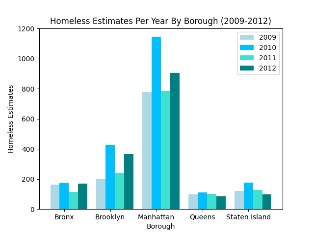
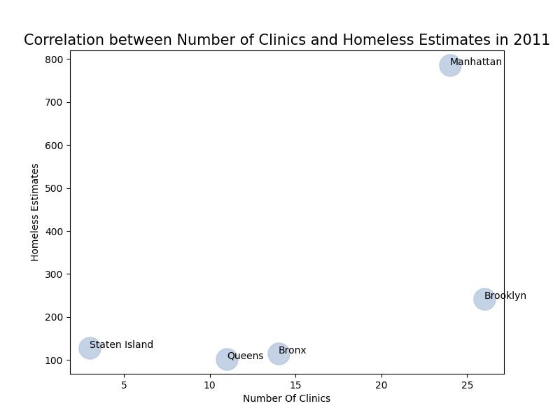
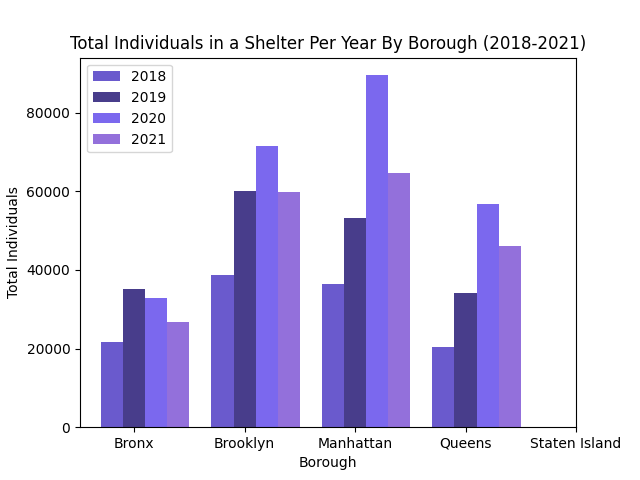
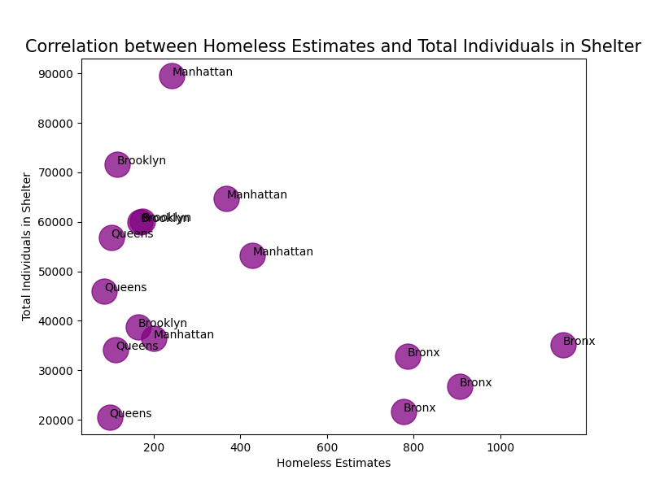

# The Effect of the Number of Health Clinics on Homelessness


### Overview:
Watching the news and through everyday observation, there has been an increase in homelessness in neighborhoods that have limited access to health clinics, shelters and 
services. I am going to use my project to display the correlation between the number of mental health clinics in neighborhoods and the rate of homelessness, while also delving deeper and looking into specific areas/districts in the neighborhood and their homelessness rate, and compare them to its attendance in new people looking for shelter and the amount of homeless individuals that reside in shelters in the area, even with the clinics availaible. This data, in turn, would further my current solution to facilitate more health clinics in areas with a high rate of impoverishment, so that more individuals would start to reside in shelters.

I downloaded the data I obtained as CSV files and have read them in as separate Dataframes. I have used pandas and its functions to use specific columns I needed for my data. For starters, I started with my data on Homelessness Numbers from 2009-2012. This is how I parsed it to use what I needed:

### Data:

For this first bar graph, the data I chose to represent comes from the Dataframe with the Homeless Estimates from the years 2009-2012. To do this, I brute-forced the data to my liking based on the respective years by using SQL to select the specific homeless estimates for that year, grouping it by its borough. Once I got each individual set of data, I loaded them each into a bar, with a corresponding color. I then set the title and the axes, and the graph came to be. Based on the data portrayed in the bar graph, you can see that Queens has the lowest homeless estimates for each year, whereas Manhattan, consequently, has the highest homeless estimates by year. The trend for Queens and Staten Island seems to be that after 2010, the homeless estimates decrease. However, this isn’t the case for the Bronx, Brooklyn and Manhattan, where after 2010, the homeless estimates decrease in 2011, but they significantly in 2012.


Based on the previous bar graph of Homeless Estimates Per Year by Borough, I decided to find the correlation between the total number of homeless estimates and the number of clinics in a particular borough for a given year. I used 2011, because the database with the health clinics reported the total number of clinics for 2011. To do this, I made separate values for the X axis and the Y Axis. I then labeled my graph accordingly and used plt.scatter() to create a scatter plot. To accurately show what points corresponded to which borough, I used a for loop to put the appropriate label on each point. As you can see, my hypothesis was proven semi-right based on this data. I came to the conclusion that the lower the number of clinics in a given borough, the higher the homeless estimates would be. However, a positive trend occurs from the points showing the homeless estimates for Queens, The Bronx, and Manhattan. From these, you can see that the number of clinics increase as we go higher in the number of homeless estimates, therefore partially disproving my hypothesis. Also, this is shown through the point for Brooklyn, where the number of clinics exceeds 25, and the homeless estimate is relatively low compared to Manhattan, for example. This proves that the higher the number of clinics in a given borough, the lower the number of homeless estimates for that borough as well, which is the opposite of my hypothesis.


For this data, I wanted to create a bar graph that was similar to my first, showing the total number of individuals who arrived at a shelter for a given year, in a specific borough. To do this, I took the same approach as the first instance and brute-forced the dataframe, newDF3, using SQL to gather the specific information I needed. The data is separated by the year, and plotted on the bar graph based on the total number of individuals arriving at a shelter for that specific year. As you can see, the only data that isn't displayed is Staten Island, and that is because there weren't any individuals represented in the table, it was only clusters of families in shelters, which is not what we want for this data. As you can see, the trend is naturally positive, except for the Bronx, where after 2019, the number of people who are being housed in a shelter decreases. However, the other datasets for Brooklyn, Manhattan and Queens display a positive outlook on the total number of individuals in a shelter at a given year. For each of the datasets, the number of individuals decrease and this most likely occured due to the general rise of COVID-19 and shelters having to suspend/postpone their offices. 


In this second scatter plot, I show the correlation between Homeless Estimates and the total number of individuals at a shelter. This data relates to my solution, which would be finding places of shelter for the homeless population to stay. I created this graph similarly to the first, by using separate values for the X and Y axes, labeling the graph accordingly based on the values, then using plt.scatter() to display the data. The points show a positive trend in shelter attendance by individuals, where the lower the homeless estimates, the higher the number of individuals arriving at/registering for a shelter. This shows that even though there does still exist homeless people in certain boroughs, the number of people in shelters far outweigh the amount of people unsheltered, which is generally a great thing and we can come to the conclusion that the homeless population is indeed being taken care of appropriately.

Lastly, I created a map to display the previous sets of data using folium. This is how I did it:
```
import folium

#showing location of health clinics
health_clinic_locations = healthclinics_roster[['Latitude' , 'Longitude', 'Facility Name']]
select_non_empty = health_clinic_locations.loc[health_clinic_locations['Latitude'].notna()]


centerOfHunter = [40.7678,-73.9645]
nyc_clinic_map_2011 = folium.Map(location=centerOfHunter, zoom_start=10, scale=13)

for ix, clinic_info in select_non_empty.iterrows():
    folium.Marker([clinic_info['Latitude'], clinic_info['Longitude']], popup=clinic_info['Facility Name']).add_to(nyc_clinic_map_2011)

#bronx 2011 homeless
folium.Marker(
    location=[40.8448, -73.8648],
    popup="Total Number of Bronx Clinics in 2011: " + str(newSomething.loc[0, 'numClinics']),
    icon=folium.Icon(color="red", icon="info-sign"),
).add_to(nyc_clinic_map_2011)

folium.CircleMarker(
    location=[40.8448, -73.8648],
    radius=50,
    popup="Total Bronx Homeless Population in 2011: " + str(newDF.loc[0, 'Homeless Estimates']),
    color="#3186cc",
    fill=True,
    fill_color="#3186cc",
).add_to(nyc_clinic_map_2011)

etc...
```
_This centers the map on Hunter's location. Then, I create a map using folium, and created markers to represent each clinic using its Latitude and Longitute values. Next, I created specific markers for each borough and its respective latitude and longitude. The Circle markers show the total homeless population of each borough and the Red markers represent the Total Number of Clinics in the borough as well. This is shown through an .html file shown below._

[Map of Clinic Locations and Total Homeless Individuals](clinic_homeless_2011.html)

This map gives a visual representation of where the clinics are in NYC and shows the respective total amounts of homeless individuals and clinics in the specific borough.

Based on my findings, it is safe to say that my hypothesis was partially disproven. This is because as shown previously, the idea that the lower the number of clinics, the higher the homeless estimates would be, was proven false in most cases. In fact, the higher the number of clinics in the borough, the less the homeless estimates were, which is the complete opposite of my original hypothesis. To add, seeing the correlation between the homeless estimates for each borough and the total number of individuals at a shelter showed that regardless of the amount of homeless estimates, it tended to be lower than the actual total amount of individuals that arrived at/registered at a shelter. This, indeed showed that the homeless population is being taken care of, with resources and health facilities to help aid them and get them back on their feet. 

### Techniques: 
The techniques I used the most were reading in csvs into DataFrames and using SQL queries to select specific data from the databases that I needed to create my visualizations. This was done using numpy and pandas to clean up the homeless estimate data, the health clinic data, and the shelter data. 
```
homeless_roster = pd.read_csv('Directory_Of_Homeless_Population_By_Year.csv')
healthclinics_roster = pd.read_csv('NYC_Health_Hospitals_patient_care_locations_2011.csv')
homelessInShelter_roster = pd.read_csv('Individual_Census_by_Borough_Community_District_and_Facility_Type.csv')

homeless_roster['Borough'] = homeless_roster['Area']

homeless_query = 'SELECT * FROM homeless_roster WHERE Year == 2011 GROUP BY Borough'
selected_Homeless_Year = psql.sqldf(homeless_query)
newDF = pd.DataFrame(selected_Homeless_Year)
print(newDF)

health_query = 'SELECT COUNT(Borough) AS numClinics, Borough FROM healthclinics_roster GROUP BY Borough'
selected_Health = psql.sqldf(health_query)
newDF2 = pd.DataFrame(selected_Health)
print(newDF2)

newSomething = newDF.merge(newDF2, left_index=True, right_index=True, how='inner')
print(newSomething)

homelessInShelter_roster['Report Date'] = pd.DatetimeIndex(homelessInShelter_roster['Report Date']).year

shelter_query = 'SELECT (SUM("Adult Family Shelter") + SUM("Adult Shelter") + SUM("Adult Shelter Commercial Hotel")) AS totalIndividuals, "Report Date" AS Year, Borough FROM homelessInShelter_roster GROUP BY Borough, "Report Date" ORDER BY "Report Date"'
selected_shelter = psql.sqldf(shelter_query)
print(selected_shelter)
newDF3 = pd.DataFrame(selected_shelter)

etc...
```

I also used matplotlib.pyplot to set up 2 bar graphs and two scatter plots to represent the findings of my data searching/results (the bar graphs) and correlate them to one another (the scatter plots).

**_First Bar Plot:_**
```
vals_2009 = list(h2009data['Homeless Estimates'])
bar1 = plt.bar(X_axis, vals_2009, width, color = 'lightblue', label = '2009')

vals_2010 = list(h2010data['Homeless Estimates'])
bar2 = plt.bar(X_axis+width, vals_2010, width, color = 'deepskyblue', label = '2010')

vals_2011 = list(h2011data['Homeless Estimates'])
bar3 = plt.bar(X_axis+width*2, vals_2011, width, color = 'turquoise', label = '2011')

vals_2012 = list(h2012data['Homeless Estimates'])
bar4 = plt.bar(X_axis+width*3, vals_2012, width, color = 'teal', label = '2012')

plt.xlabel("Borough")
plt.ylabel("Homeless Estimates")
plt.title("Homeless Estimates Per Year By Borough (2009-2012)")

plt.xticks(X_axis + width, list(testing['Borough']))
plt.legend( (bar1, bar2, bar3, bar4), ('2009', '2010', '2011', '2012') )
```

**_First Scatter Plot:_**
```
Xval = newDF2['numClinics']
Yval =newDF["Homeless Estimates"]

annotations=list(newDF2['Borough'])

plt.figure(figsize=(8,6))
plt.scatter(Xval,Yval,s=500, alpha = 0.75, color="lightsteelblue")
plt.xlabel("Number Of Clinics")
plt.ylabel("Homeless Estimates")
plt.title("Correlation between Number of Clinics and Homeless Estimates in 2011",fontsize=15)
for i, label in enumerate(annotations):
    plt.annotate(label, (Xval[i], Yval[i]))
```

Lastly, I used folium (as shown in the code above) as the means to creating the map of the clinic locations and the total number of homeless estimates in a specific borough. Because I did not have a geoJson file to create a chloropleth map, I decided to use the latitude and longitude values from the healthclinics_roster table I read in, and plotted the corresponding points. 


### Citations:
https://data.cityofnewyork.us/Social-Services/Directory-Of-Homeless-Population-By-Year/5t4n-d72c
https://data.cityofnewyork.us/Health/NYC-Health-Hospitals-patient-care-locations-2011/f7b6-v6v3
https://www.coalitionforthehomeless.org/wp-content/uploads/2021/11/NYC_Homeless_Shelter_Population-Worksheet_1983-9-202121.pdf
https://data.cityofnewyork.us/Social-Services/Individual-Census-by-Borough-Community-District-an/veav-vj3r
https://data.cityofnewyork.us/Social-Services/Buildings-by-Borough-and-Community-District/3qem-6v3v
https://data.cityofnewyork.us/Social-Services/DHS-Daily-Report/k46n-sa2m
https://www.kite.com/python/answers/how-to-append-an-item-to-a-pandas-series-in-python
https://stackoverflow.com/questions/25792086/pandas-merge-return-empty-dataframe
https://thispointer.com/python-how-to-check-if-an-item-exists-in-list-search-by-value-or-condition/
https://pandas.pydata.org/pandas-docs/stable/user_guide/merging.html
https://www.w3schools.com/sql/sql_groupby.asp
https://www.analyticsvidhya.com/blog/2020/02/joins-in-pandas-master-the-different-types-of-joins-in-python/
https://pandas.pydata.org/docs/reference/api/pandas.DataFrame.merge.html#pandas.DataFrame.merge
https://www.sqlshack.com/how-to-write-sql-queries-with-spaces-in-column-names/
https://stackoverflow.com/questions/25146121/extracting-just-month-and-year-separately-from-pandas-datetime-column?rq=1
https://towardsdatascience.com/creating-a-simple-map-with-folium-and-python-4c083abfff94
https://www.pluralsight.com/guides/map-visualizations-in-python-using-folium
https://www.geeksforgeeks.org/plot-multiple-columns-of-pandas-dataframe-on-bar-chart-with-matplotlib/
https://matplotlib.org/stable/gallery/color/named_colors.html
https://www.w3schools.com/python/matplotlib_scatter.asp
https://www.mssqltips.com/sqlservertip/6827/python-bar-chart-line-charts-examples/
https://pandas.pydata.org/docs/reference/api/pandas.DataFrame.plot.line.html
https://www.delftstack.com/howto/matplotlib/matplotlib-label-scatter-plot-points/
Previous Homework Assignments
